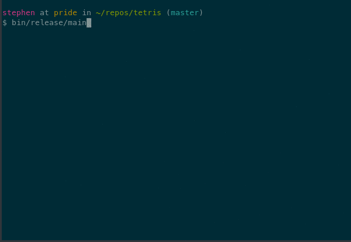

Tetris
======

Attention!
This proThis project is reproduced in https://github.com/brenns10/tetris.After debugging, the program can run normally, but there is no sound, please help me, how to make the program run with nice background music, thank you very much for your help.

A tetris game in C using NCURSES.  It's pretty feature complete, except for
stretch goals I may pick up in my free time.

Building
--------

My dependencies are:

* `libsdl` and `libsdl_mixer` 1.2 for sound.
* `ncurses` for terminal manipulation.

To install them on Ubuntu:

    sudo apt-get install libsdl-mixer1.2-dev libncurses5-dev

To compile:

    make

To run:

    bin/release/main

Instructions
------------

The controls are typical of Tetris:
* <kbd>←</kbd> and <kbd>→</kbd>: Move the tetromino,
* <kbd>↑</kbd>: Rotate (clockwise?) the tetromino,
* <kbd>↓</kbd>: Immediately drop the tetromino (not a fast drop, an immediate drop),
* <kbd>Q</kbd>: Exit the game prematurely,
* <kbd>P</kbd>: Pause the game (any key to resume),
* <kbd>B</kbd>: "Boss mode" - show a mock terminal screen to fool nosy onlookers.  Hit
  <kbd>F1</kbd> to resume the game afterwards.
* <kbd>S</kbd>: Save game and exit (just assumes filename `tetris.save`).  To resume the
  game, run `bin/release/main tetris.save` (or whatever you may have renamed the
  game save to).

Future/Stretch Goals
--------------------

